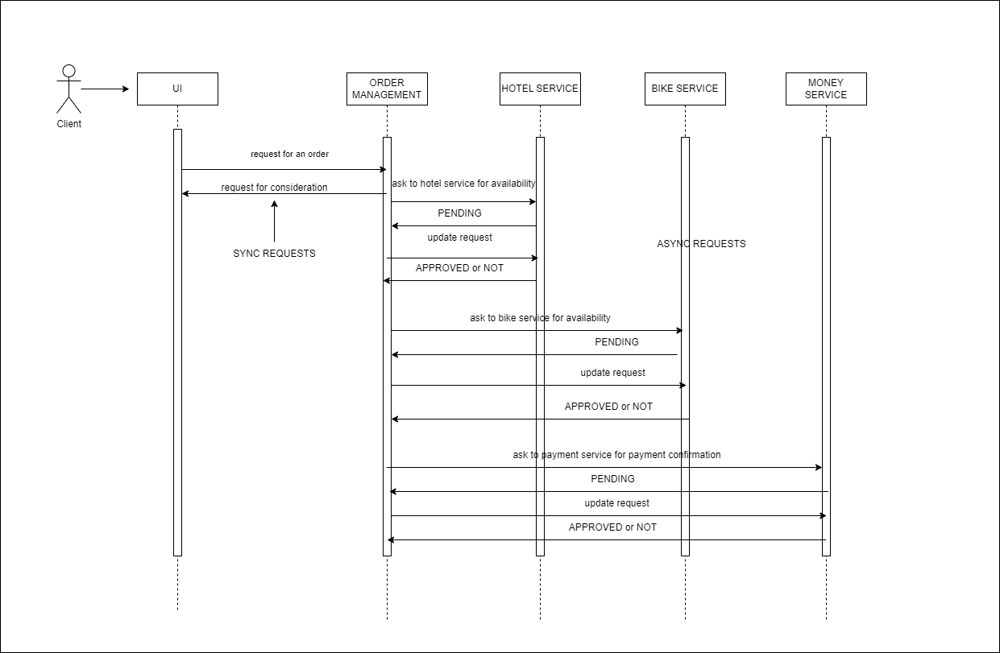

# Fides WorkShop Project
This is the repository for the Fides Workshop project.
We organize the work in order to acomplish the projects main goals:
- [X] Create a backend using a microservice architecture
- [ ] Set up an ELK stack to monitor the services
- [X] Have the environment running on a docker-compose file
- [X] Create a simple frontend to interact with the backend

## Contributors
- [Riccardo Leone](https://github.com/PapaLeoneIV)
- [Emma Veronelli](https://github.com/minestrinad)

## Build prerequisites
To build the project you need to have the following tools installed on your machine:
- python3
- docker

## Architecture
The project is divided in two main parts:
- The backend, which is a microservice architecture
- The frontend, which is a simple web application

### Backend
The backend is composed by four business services:
- The authentication service (auth) which is responsible for the authentication of the users
- The Order management service (order) which is responsible for the management of the orders
- The bike rental service (bike) which is responsible for the management of the bike rentals
- The Hotel booking service (hotel) which is responsible for the management of the hotel bookings
And others helper services:
- A database service for each business service
- The RabbitMQ service which is responsible for the communication between the services
- The ELK stack which is responsible for the monitoring of the services

The services are connected to each other using a RabbitMQ message broker and also API calls.
This is an example of the flow of an order request:
<!-- dsisplat a jpg from a local url -->


### Frontend
The frontend is a simple web application that allows the user to interact with the backend services.

## How to run the project
The project is still in development, so the only way to run it is to run it in development mode.
To run the project you need to have docker installed on your machine.
Once you have docker installed you can run the following command in the root directory of the project:

```bash
python3 manage.py start-dev
```

To stop the project you can run the following command in the root directory of the project:
```bash
python3 manage.py stop
```
