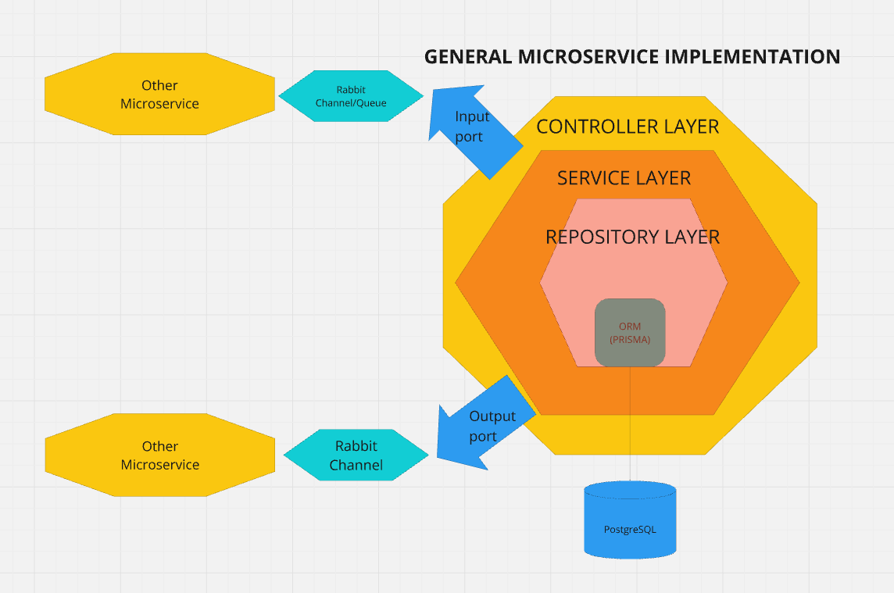

# Fides WorkShop Project
This is the repository for the Fides Workshop project.

## Goals
We organize the work in order to acomplish the projects main goals:

- [X] Create a backend using a microservice architecture with Node and ExpressJS
- [X] Frontend developed with NextJS as a simple interface for the backend
- [X] Organized work and directory around Layered Architecture
- [X] Use of various Design Patterns (Repository Patterns, State Pattern, Saga Pattern, ...) 
- [X] Async communication between microservices through RabbitMQ
- [X] Sync communication between Client-Server with HTTP Req/Res
- [X] Auth/Registration with JWT Token
- [X] Developed Distributed Database System
- [X] Developed SAGA PATTERN to handle cancellation of orders
- [X] Have the environment Dockerized
- [ ] Set up an ELK stack to monitor the services

## Contributors
- [Riccardo Leone](https://github.com/PapaLeoneIV)
- [Emma Veronelli](https://github.com/minestrinad)

## Build prerequisites
To build the project you need to have the following tools installed on your machine:
- `docker`

## Architecture
The project is divided in two main parts:
- The backend, implement with microservice architecture
- The frontend, which is a simple web application

### Backend
The backend is composed of five business services:
- Authentication service
- Order management service 
- Bike rental service 
- Hotel booking service
- Payment Service
And others helper services:
- A database service for each business service
- The RabbitMQ service which is responsible for the communication between the services
- The ELK stack which is responsible for the monitoring of the services

### Macro View of MicroService Architecture


### Macro View of MicroService Communication Architecture


### Frontend
The frontend is a simple web application that allows the user to interact with the backend services.

## URLs
- **http::/localhost:6969/auth/register** (Used to register a User)
- **http::/localhost:6969/auth/login** (Used to Login a User)
- **http::/localhost:6969/homepage** (Page to insert the order)
- **http::/localhost:6969/summary** (Page where the Order Result is shown)


## How to run the project
Once you have docker installed, run the following command in the root directory of the project:
```bash
git clone git@github.com:PapaLeoneIV/MicroservicesArchApp.git && \
cd MicroservicesArchApp && \
chmod +x start-up.sh && \
bash start-up.sh dev
```

## Known Problems(To be fixed)

### Set up RabbitMQ Exchange
At the moment `order-management-service` takes care of setting up the Exchange, it obviously gives problem 
during the set up of all the containers where a service is setting up a queue. 

### Components background color
`Chrome` `Brave` browser seem to render some shadcn/nextui components background color in black and the usability of the app decreases, `Mozilla` seems the only one to not do it.

### Starting script

If your not able to start the project with our `start-up.sh` run the following commands:
```bash
docker compose up rabbitmq db_bike_rental db_hotel_booking \
  db_payment_confirmation db_order_management \
  db_auth config_service
```

Once all the Dbs, rabbit server and the config microservice are running: 
```bash
docker compose up authentication-service bike-rental-service \
  hotel-booking-service payment-confirmation-service \
  order-management-service
```
