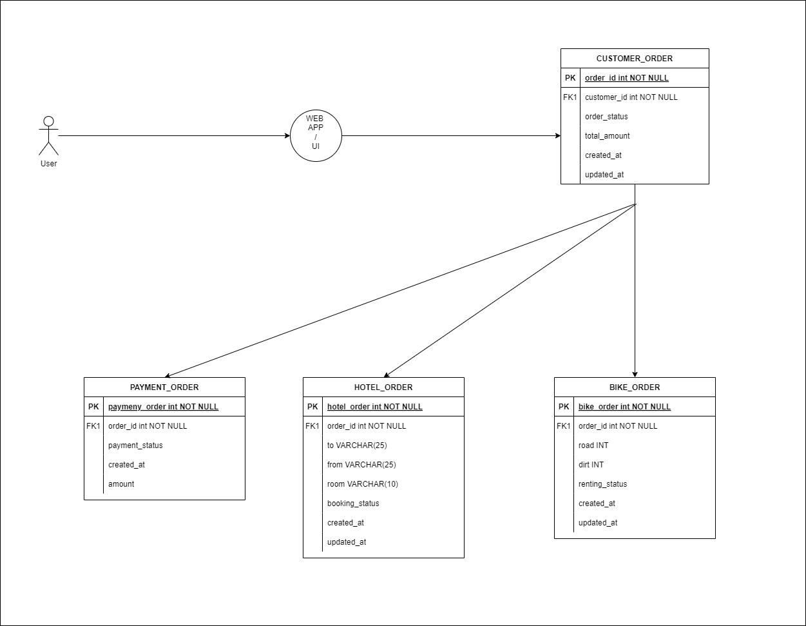

# Databases

## Introduction
Each service is responsible for managing its own database. The database is a PostgreSQL database and is managed by the service itself. The database is created when the service is started and is destroyed when the service is stopped. The database is created using the `psql` command line tool.

## Database schema
